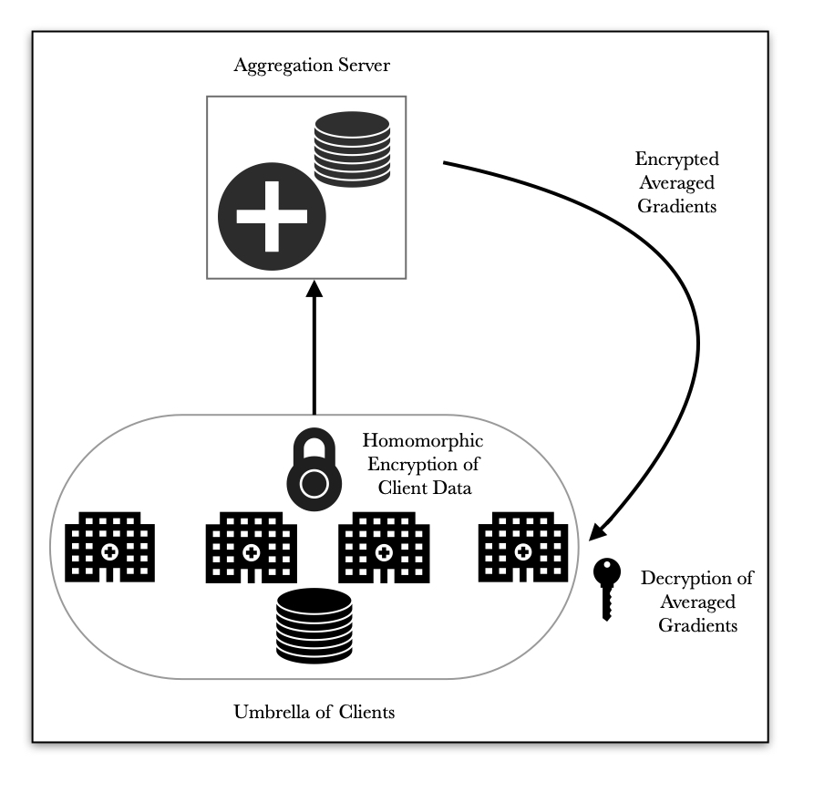
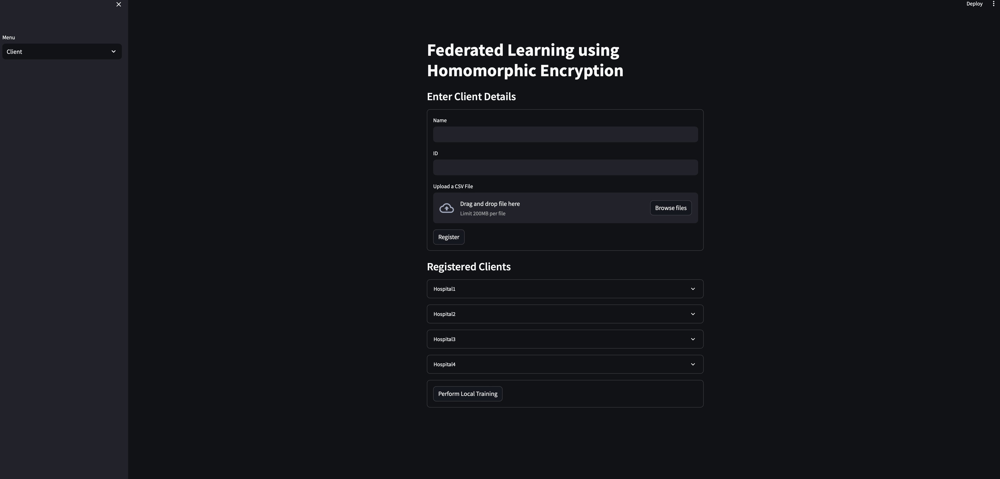
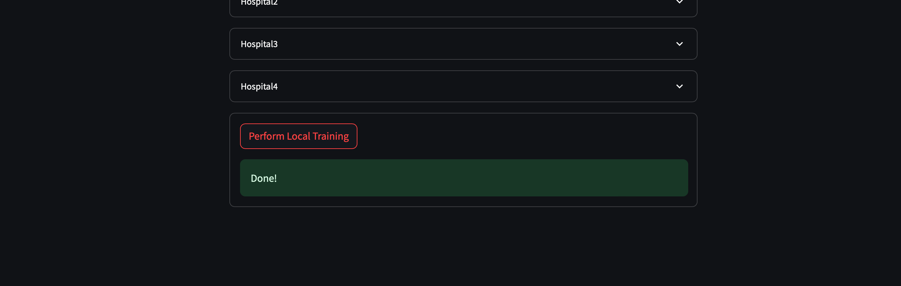
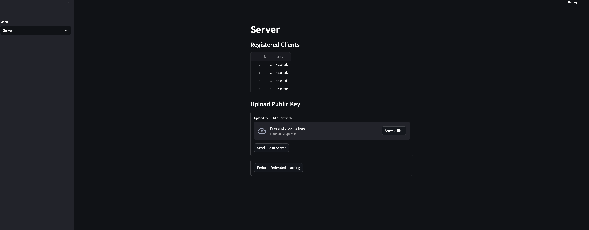
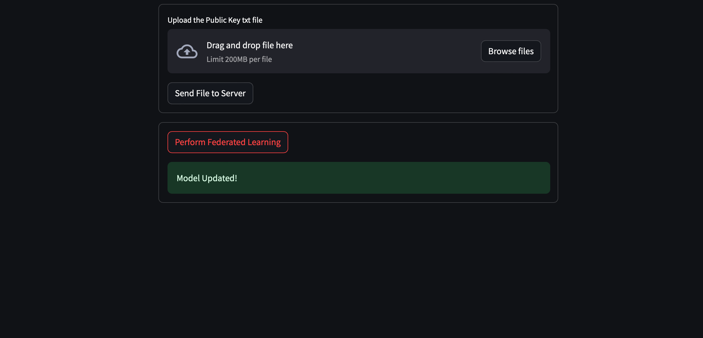
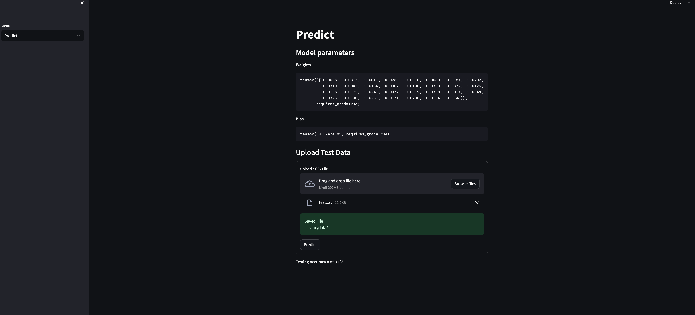

# Simulating Federated Learning with Homomorphic Encryption

This GitHub repository contains the code and resources for simulating Federated Learning with Homomorphic Encryption using a Streamlit app and Flask. This project demonstrates how to train machine learning models across clients while preserving data privacy through homomorphic encryption. The Streamlit app serves as the user interface for managing and monitoring the federated learning process

## Requirements

Before using this project, ensure you have the following dependencies installed:

- Python 3.9
- [Streamlit](https://streamlit.io/)
- [Flask](https://flask.palletsprojects.com/en/2.1.x/)
- [TenSeal](https://github.com/OpenMined/TenSEAL)
- [PyTorch](https://pytorch.org/)

You can install these dependencies using pip:

```bash
pip install streamlit flask tenseal torch
```

## Homomorphic Encryption
In this project, we leverage the power of [TenSEAL](https://github.com/OpenMined/TenSEAL), a cutting-edge library for homomorphic encryption. TenSEAL enables us to perform secure and privacy-preserving computations on encrypted data.

Run the below command to generate a private - public key pair in the `keys` folder.

```bash 
python3 generatekeys.py 
```

## Federated Learning

### Overall Architecture

A basic Federated Learning with Homomorphic Encryption architecture is shown below. Here we have an Umbrella of Clients, who are trustworthy and related. They share a secret key with eachother. This key is used to encrypt their data and then sent to an aggregation Server. The Server averages out the encrypted data using the Public Key and returns the new weights. The new weights are decrypted by all clients and their models are updated.

<div align = "center">

</div>

### Application

Streamlit is used to create a simple application where you can perform the entire federated learning process from the client and server, and perform a prediction using the new updated model after a federated learning.

Use the below command to run the streamlit application -

```bash 
streamlit run client/app.py
```

The requests to the server is handled using Flask.

To run the flask app do -

```bash 
flask --app server/server.py run
```

#### Client - Upload the local datasets, register and perform local training

<p float="center">
  
   
</p>

#### Server - Registered Clients will be displayed, upload the Public Key & perform Federated Learning on click of a button


<p float="center">
  
   
</p>

#### Predict - Upload a Test CSV file and measure the accuracy of your federated learning model

<div align = "center">

</div>

### Model

A Simple Logistic Regression model was used on the Breast Cancer Classification Dataset.

## References

- TenSeal - https://github.com/OpenMined/TenSEAL
- https://github.com/viensea1106/Federated-Learning-meets-Homomorphic-Encryption
